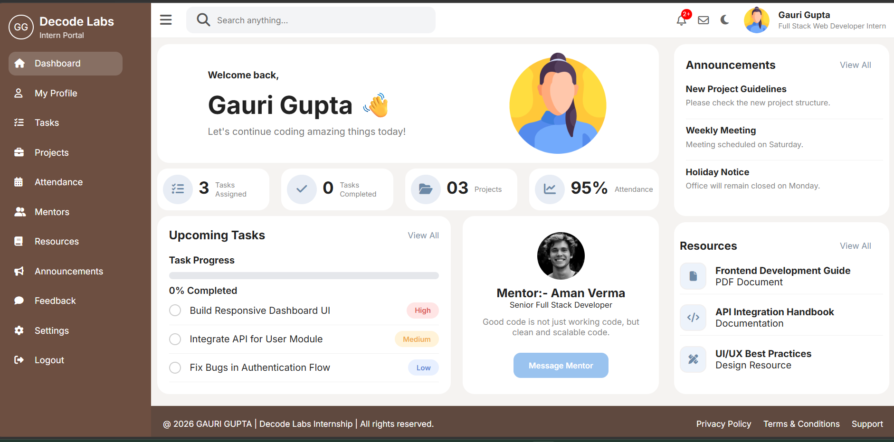

# Week 1 - Frontend Core

## Project
Intern Portal Dashboard

## Technologies Used
- HTML5
- CSS3
- JavaScript

## Features
- Responsive Design
- Dark Mode
- Sidebar Navigation
- Task Progress Tracking
- Notifications & Messages
- Mentor Section
- Local Storage Support

## UI Structure
- No broken Layout
- No Overflow
- No Hidden Buttons
- Images Fit Properly
- Adaptive Interfaces

## Preview

## Repository

GitHub Repository:
https://github.com/gauri9368gupta-maker/Decodelab-project

## Live Demo
https://gauri9368gupta-maker.github.io/Decodelab-project/
